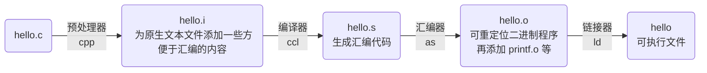
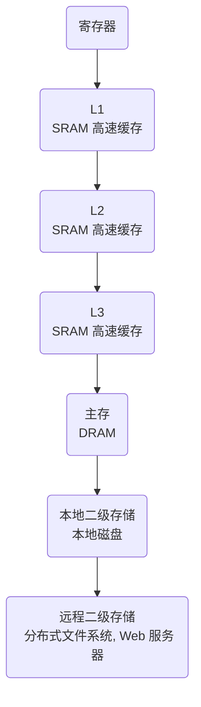

# csapp introduction

## Topic Index

>   这里是后续学习过程中，各章节对应的内容

1.   中央处理器，CPU，第 3 ~ 4 章
2.   主存，第 6 章
3.   进程，第 8 章
4.   虚拟内存，第 9 章
5.   文件，第 10 章
6.   线程，第 12 章

## C Language

>   C 语言的起源

贝尔实验室，1969 ~ 1973 创建，1989 发布 ANSI C 标准

国际标准化组织（International Standards Organization，ISO）定义了 C 语言以及一系列库函数，即所谓 C 标准库

C 一开始用于 Unix 系统开发，包括内核、程序编写

>   GNU，Linux，GCC

GNU，英文全称为 *GNU's Not Unix!*，GNU 是一个开源项目，包含很多用于调试和编写  Linux 系统的相关项目（包括 Kernel，debug 等）；可以理解为 GNU 是脚手架，而 Linux 是独立出去的内核项目，其的运作需要 GNU 脚手架，

GCC、GDB、EMACS 等，都是由 GNU 项目提供的工具集

>   程序的生命周期

编译系统：

以下是使用 `gcc -o hello hello.c` 所使用的编译系统



1.   预处理阶段，预处理器 cpp 将源码中的 `#include <stdio.h>` 等头文件插入到程序中，生成 hello.i 文件

2.   编译，编译器 ccl 将 hello.i 编写成汇编代码 hello.s 的形式

     ```assembly
     main:
     	push ebp
     	mov ebp, esp
     	push [unk_602010]
     	call puts
     	mov eax, 0
     	mov esp, ebp
     	pop ebp
     	ret
     ```

3.   汇编，汇编器 as 将 hello.s 翻译成机器语言 hello.o

4.   链接，链接器 ld 将 hello.o 结合其他的机器语言文件 printf.o 等内容链接起来，生成可执行文件 hello

## 硬件组成

### 计算机系统的硬件组成概览

计算机系统需要如下几个硬件设备组成


可以将如图 1-4 中的硬件组成看作是一条工厂流水线。下面以运行程序 hello 为例，简要地介绍硬件组成中各部分的作用

1.   总线

     总线是贯穿整个系统的抽象管道，它将携带信息字节于各个部件之间传递，总线所传递的内容单位是**字（word）**，字长是根据不同的系统架构而有所不同的，在 32 位架构下字长是 **1 Word = 4 Bytes = 32 bit**；在 64 位架构下是 **1 Word = 8 Bytes = 64 bit**。

     简单地说，**总线**就是流水线上连接各硬件之间的传动带，当需要运行程序 hello 时，首先需要将程序本地装载到内存中，而"装载"的过程就是从磁盘中将 hello 的数据放到 **I/O 总线**中，主存储器通过 I/O 桥和**内存总线**获取程序的数据，装载到主存储器自己内存序列中。

2.   I/O 设备

     I/O 设计即为系统与外部世界的联系通道，最基础的 I/O 设备一般有几种：作为输入的键盘和鼠标、作为输出的显示屏、用于长期存储程序和数据的磁盘驱动器等。

     举简单例子来讲，就是当用户想要把字符 hello 输入到计算机中，则就是通过键盘敲击按键，键盘内部再经过一系列的运作把 hello 这个数据放到 **I/O 总线**里供其他硬件使用。用户将 hello 传给计算机，这其中硬盘就充当了 I/O 设备。

     I/O 设备也可以是硬件之间自己数据传输，例如计算机需要从磁盘中读取 hello 程序的数据，则磁盘就是 I/O 设备。

     会在第 6 章获取到更多关于 I/O 设备是如何工作的介绍。

3.   主存

     主存是一个临时存储设备，主要作用是为处理器执行时用于存放 **程序** 和 **处理过后的数据**。处理器不能直接访问硬盘中的数据，而是需要先将硬盘中的数据调入到主存中，再对主存中的这些数据进行处理。

     可以有一种比较通俗的理解就是，结合存储设备的层次结构，运行越快的设备其空间越小、造价越贵，这其中主存就是运行快、空间小的，而硬盘就是空间大、运行慢。通常我们所说的内存指的就是这里的主存储器，也叫主存、运行内存；而磁盘空间则被称之为硬盘空间，外存。

     假设一台笔记本电脑标配 8GB 运行内存，以及 512GB 存储空间，当我们需要运行程序 hello 时，hello 的本体数据首先会被从**存储空间**中调入到**运行内存**，然后处理器再对运行内存中 hello 相应数据进行处理。

     很明显，hello 不是每次开机都要被运行的，只有要运行时才会被调入到内存，而只有被调入到内存才会被处理器进行处理。当 hello 不需要被运行，则将其存储在外存中，以备之后使用。

     第 6 章中将具体介绍存储器技术。

4.   处理器

     1.   中央处理单元（CPU），也称处理器，就是计算机最核心的东西，其作用是解释或执行存储在主存中的指令。处理器中有一个组件名为程序计数器（Process Counter，PC），其中存储着主存中的某个地址（大小为一个字），处理器会根据 PC 里的具体地址来运行其地址上对应的指令内容，

          假设 PC 中存储的地址内容为：0x4001080，而主存中 0x4001080 位置存着一条指令 `add eax, 1`，该指令的意义是让 eax 寄存器自加 1；
     
          则 PC 在整个流程中的作用为：当处理机处理完上一条地址中的代码后，PC 告诉处理机下一条要处理的指令的地址，可以说，PC 控制着 CPU 的运行流程。
     
          同时，CPU 在执行指令时还会更新 PC 的值，大多数情况下都是将其更新为当前地址的下一条地址，碰到 `jmp` 等指令时，会使得跳转到其他不相邻的地址。 
     
     2.   如图 1-4 所示，CPU 还包含寄存器（register files）和算术/逻辑单元（ALU），CPU 的运行还围绕着这些寄存器、逻辑运算单元和主存来运行。处理器常见的处理行为如下：
     
          1.   加载：从主存复制内容到寄存器，并且会覆盖掉原来的内容；
          2.   存储：从寄存器复制内容到主存的某个位置，覆盖掉原来的内容；
          3.   操作：把两个寄存器里的内容复制到 ALU，然后由 ALU 对这两个内容做算术运算，结果存到一个寄存器中，覆盖掉原来内容；
          4.   跳转：从当前运行的指令中抽取一个字（一个地址），并将该内容复制到 PC 中，覆盖掉 PC 原来的值，使得下一步 CPU 会去运行这个地址中的指令
     
     会在第 3 ~ 4 章详细介绍 CPU 是如何工作的。

### 程序是怎样运行的

以图 1-4 所示的硬件设备为例，目的是运行前文的由 hello.c 经过编译后形成 hello 文件：

1.   向处理器提交作业
     1.   用户从 **USB 控制器**（键盘）输入 `hello` 字符串
     2.   操作系统提供的用户接口程序将字符串中的字符通过 **I/O 总线**、**I/O 桥**、**CPU 中的总线接口**逐一读取到**寄存器**中
     3.   CPU 根据将**寄存器**中的字符通过 **CPU 的总线接口**、**I/O 桥**装载到**主存储器**中
2.   将程序装载到主存空间
     1.   shell 程序读取主存储器中的目标程序路径 `hello`
     2.   shell 通过一系列指令将 hello 的二进制程序文件本体从**磁盘**中，通过**磁盘控制器（磁盘 I/O）**、**I/O 总线**以及**I/O 桥**装载到主存储器中

3.   CPU 读取主存中的代码并执行、输出结果
     1.   CPU 从主存储器中，通过 **I/O 桥**获取 hello 代码的 main 函数中的机器语言指令并执行
     2.   执行的结果被从 CPU 中通过 **I/O 桥**、**图形适配器**输出到**显示器**上


总的来讲，在运行 `hello` 程序时，首先将运行的目标装载到主存，再根据主存中运行的目标

### 存储设备的层次结构

存储器层次结构大致分为七个等级，L0 为最高级，L6 为最低级；越高级空间越小、运行越快、造价越贵



## 操作系统

操作系统层介于 **应用层** 和 **硬件层** 之间，是一种软件；

程序在运行时，不能直接调用到计算机硬件，而是必须交由操作系统对硬件进行调配和使用

>   Unix，Posix 以及 Unix 规范

贝尔实验室，1973 年使用 C 重写 Unix 内核，1974 年对外发布；后续还发布了 System V Unix，

20 世纪 70 ~ 80 年代，美国加州大学伯克利分校为 Unix 发布版本添加了 虚拟内存 和 Internet 协议，称之为 *Unix 4. xBSD（Berkeley Software Distribution）*

今天的 Solaris 系统则是由这些初始的 BSD 和 System V 衍生而来；

Posix，是一种 Unix 开发标准化规范，涵盖诸如系统调用的 C 语言接口，shell 程序，网络编程等内容

>   进程，虚拟内存，文件，线程

会在第 8 章，第 9 章，第 10 章，第 12 章进入详细解析